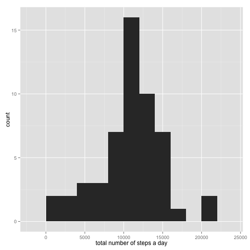
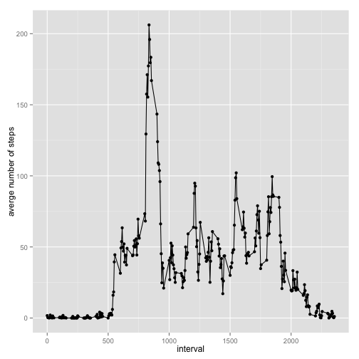
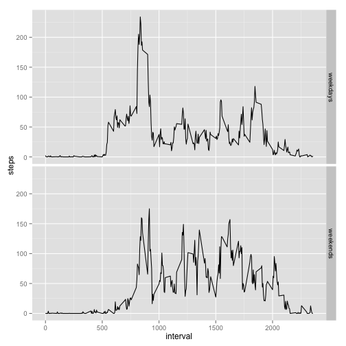

# Reproducible Research: Peer Assessment 1

## Loading and preprocessing the data

```r
library("ggplot2")
# read the data set
file_name <-"activity.csv"
data_set <- read.csv(file_name)
data_set$date <- as.Date(data_set$date, format="%Y-%m-%d")
```


## What is mean total number of steps taken per day?


```r
data_set_daily <- aggregate(data_set$steps, by=data_set["date"], FUN=sum)
colnames(data_set_daily) <- c("date", "totalsteps")
qplot(data_set_daily$totalsteps, binwidth=2000, xlab="total number of steps a day")
```

 

```r
daily_mean = mean(data_set_daily[["totalsteps"]], na.rm=T)
daily_median = median(data_set_daily[["totalsteps"]], na.rm=T)
```

The mean and median number of steps taken per day are 1.0766 &times; 10<sup>4</sup> and 10765 respectively.

## What is the average daily activity pattern?


```r
data_set_interval <- aggregate(data_set$steps, by=data_set["interval"], mean, na.rm=T)
colnames(data_set_interval) <- c("interval", "meansteps")
qplot(interval, meansteps, data=data_set_interval, xlab="interval", ylab="averge number of steps") + geom_line() 
```

 

```r
maxsteps_interval <- max(data_set_interval$meansteps)
max_interval <- data_set_interval[data_set_interval$meansteps==maxsteps_interval, "interval"]
```

The 5 minute interval that contains the most number of steps on average is 
835.

## Imputing missing values


```r
is_missing <- is.na(data_set$steps)
missing_values <- which(is_missing==TRUE)
num_missing_values <- length(missing_values)
missing_values_interval <- data_set[missing_values, "interval"]
```

The total number of missing values is 2304. For the missing values for `steps`, we replace them by mean values on corresponding intervals.


```r
interval_mean <- aggregate(data_set$steps, by=data_set["interval"], mean, na.rm=T)
colnames(interval_mean) <- c("interval", "mediansteps")
new_data_set <- read.csv(file_name)
new_data_set[missing_values, "steps"] <- sapply(missing_values_interval, FUN=function(x) return(interval_mean[interval_mean$interval==x, "mediansteps"]))
```


```r
new_data_set_daily <- aggregate(new_data_set$steps, by=new_data_set["date"], FUN=sum)
colnames(new_data_set_daily) <- c("date", "totalsteps")
qplot(new_data_set_daily$totalsteps, binwidth=2000, xlab="total number of steps a day")
```

 

```r
new_daily_mean = mean(new_data_set_daily[["totalsteps"]])
new_daily_median = median(new_data_set_daily[["totalsteps"]]) 
```

After the replacement, we calculate the mean and median number of steps per day. They are 1.0766 &times; 10<sup>4</sup> and 1.0766 &times; 10<sup>4</sup> respectively. Compared with their values before replacements 1.0766 &times; 10<sup>4</sup> and 10765, the mean increases and the median stay the same.


## Are there differences in activity patterns between weekdays and weekends?


```r
data_set <- data_set[complete.cases(data_set), c("steps", "date", "interval")]
data_set$weekdays <- sapply(data_set$date, FUN=function(x) {if (weekdays(x) %in% c("Saturday", "Sunday")) return("weekends") else return("weekdays")})
data_set_weekdays <- aggregate(data_set$steps, by=data_set[c("interval", "weekdays")], mean)
colnames(data_set_weekdays) <- c("interval", "weekdays", "steps")
ggplot(data_set_weekdays, aes(x=interval, y=steps)) + facet_grid(weekdays~.) + geom_line()
```

 

There are more activities during the weekends than weekdays. However, there are more early activities  in weekdays, while there are more late activities in weekends.
